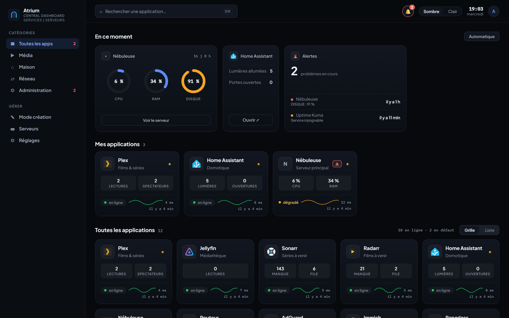
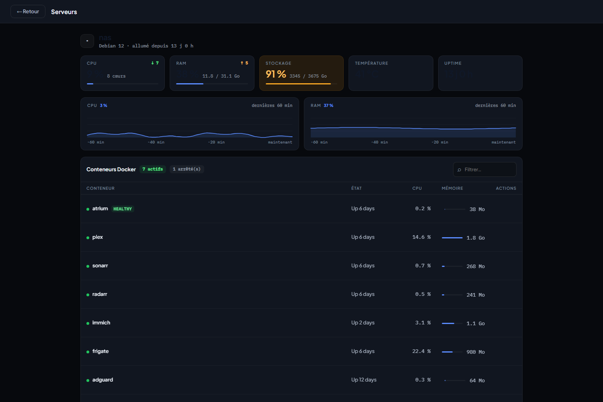
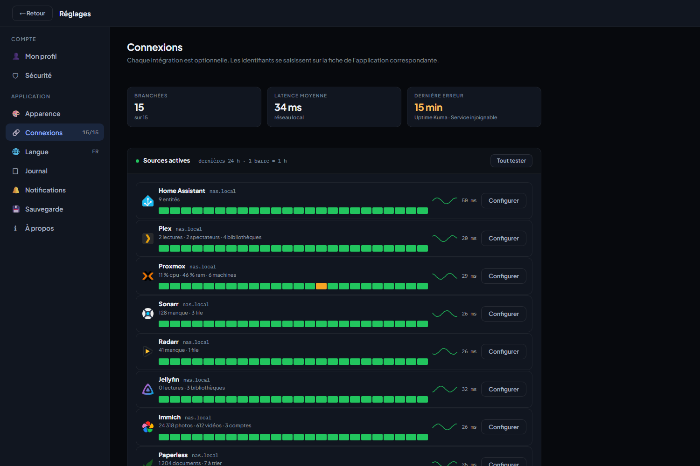
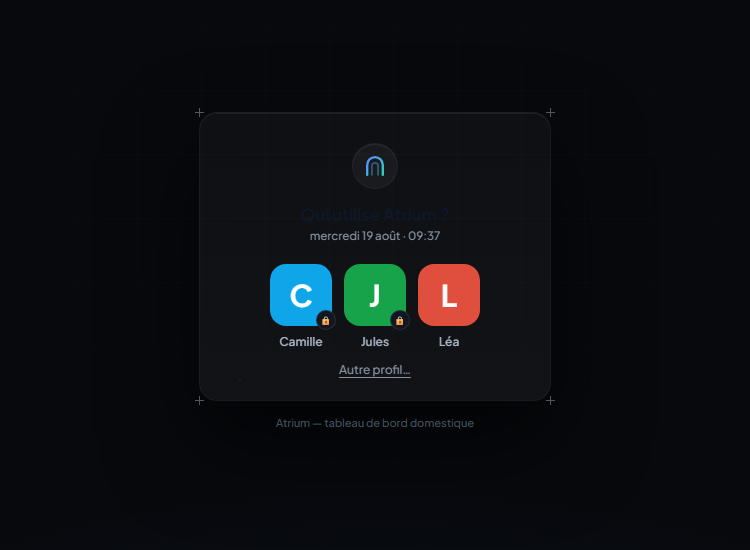
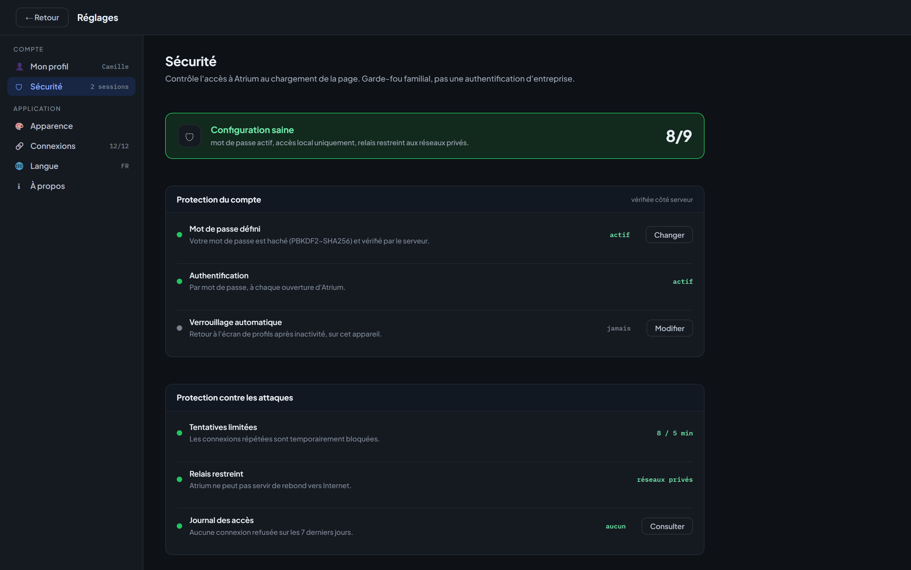

<h1 align="center">
  <br>
  Atrium
</h1>

<p align="center">
  <b>Tableau de bord auto-hébergé pour votre maison.</b><br>
  Vos applications, l'état de vos serveurs et ce qui s'y passe en ce moment, sur une seule page.
</p>

<p align="center">
  <a href="https://github.com/Alardware/atrium/releases"></a>
  <a href="https://github.com/Alardware/atrium/actions/workflows/securite.yml"></a>
  <a href="https://github.com/Alardware/atrium/pkgs/container/atrium"></a>
  
  <a href="LICENSE"></a>
</p>



## En bref

- **Application autonome.** Aucune autre brique n'est requise : chaque
  intégration (Plex, Unraid, UniFi, Home Assistant…) est optionnelle et se
  branche depuis l'interface.
- **Aucune dépendance.** Python et sa bibliothèque standard, rien d'autre —
  l'image ne contient même plus `pip` après construction.
- **Les mesures sont prises par le serveur**, jamais par le navigateur :
  l'état reste connu sans onglet ouvert.
- **50 intégrations** qui remontent de vrais chiffres, et n'importe quelle
  autre application pour l'état en ligne.
- **Tout reste chez vous**, dans un seul fichier : `/config/atrium.json`.

## Démarrer

```yaml
services:
  atrium:
    image: ghcr.io/alardware/atrium:latest
    container_name: atrium
    restart: unless-stopped
    ports:
      - "8420:8420"
    volumes:
      - ./data:/config
    environment:
      TZ: Europe/Paris
      PUID: "1000"      # 99 sur Unraid
      PGID: "1000"      # 100 sur Unraid
```

```bash
docker compose up -d
```

Puis ouvrez `http://<ip-du-serveur>:8420`. Le premier écran crée votre profil.

Les autres méthodes — ligne de commande, Unraid, add-on Home Assistant — sont
plus bas, dans [Installation](#installation).

## Sommaire

- [Ce qu'Atrium fait](#ce-quatrium-fait)
- [Installation](#installation)
- [Configuration](#configuration)
- [Intégrations](#intégrations)
- [Sécurité](#sécurité)
- [Versions](#versions)
- [Développement](#développement)

## Ce qu'Atrium fait

**Il surveille.** Le serveur sonde vos services toutes les trente secondes et
mesure leur temps de réponse. Il ne se contente pas de « en ligne / hors
ligne » : un service qui répond mais dont une mesure a franchi un seuil est
**dégradé**, et c'est dit. Les seuils sont déclaratifs — un disque à 95 % est
critique, une grappe à 55 °C mérite un avertissement.

**Il n'invente rien.** Chaque chiffre vient d'une mesure. Pas de courbe sans
relevés, pas de tendance sans historique assez ancien, pas de barre sans
échelle. Quand une information n'est pas connue, la page le dit.

**Il se souvient.** La disponibilité de chaque service est conservée heure par
heure sur trente jours : deux entiers par service et par heure, une centaine de
kilo-octets en tout. Le tableau « Santé des services » en montre les
vingt-quatre dernières, et distingue une heure sans panne d'une heure sans
mesure — un service ajouté ce matin n'affiche pas « 100 % sur 24 h ».

### La page Serveurs

CPU, mémoire, stockage et température de la machine, avec la tendance sur le
dernier quart d'heure et une heure d'historique. Si la socket Docker est
montée, la liste des conteneurs avec leur consommation et de quoi les
redémarrer.

**Aucune intégration n'est nécessaire, et aucun agent n'est à installer** : ces
mesures sont lues dans `/proc` et `/sys`, qui reflètent la machine hôte depuis
le conteneur. N'importe quel hôte Linux faisant tourner Docker convient —
Unraid, Synology, TrueNAS, OpenMediaVault, Proxmox, Debian, Raspberry Pi OS.
L'intégration Unraid de la table plus bas est autre chose : elle interroge
l'API d'un serveur Unraid **distant**, pour ce que `/proc` ne dit pas (état de
la grappe, parité).

Deux réserves, dites honnêtement : sous Docker Desktop (Windows, macOS) le
conteneur voit la machine virtuelle Linux, pas votre machine ; et l'occupation
affichée est celle du volume qui porte `/config`, pas la somme de vos disques.
Quand une mesure n'est pas lisible, la carte disparaît au lieu d'afficher zéro.



### Les connexions

Une source est « branchée » quand elle a effectivement livré des mesures —
c'est la seule preuve qui vaille. La page donne le temps de réponse de chacune,
ce qu'elle remonte, la raison quand ça ne marche pas, et sa disponibilité des
vingt-quatre dernières heures, une barre par heure.



### Filtrer d'un clic

Sous le titre, une rangée de compteurs : toutes, hors ligne, dégradées, en
ligne, non surveillées. Chacun dit combien, et ne garde qu'eux quand on le
clique — recliquer défait le filtre. En dessous de trois applications, la
rangée ne s'affiche pas : elle pèserait plus qu'elle n'aiderait.

### Ranger les tuiles

En mode création, une tuile se saisit et se dépose où on veut : l'ordre affiché
est celui de la configuration, partagé avec les autres appareils. Le classement
par catégorie et la recherche ne changent que la vue — la place retenue reste
la vraie.

### Notifications

Un tableau de bord qui surveille sans rien dire ne sert qu'à celui qui le
regarde. Réglages → **Notifications** : une adresse de crochet — Discord, ntfy,
Gotify, ou n'importe quel service acceptant un POST — et le choix de ce qui
mérite un message : un service qui tombe, une mesure qui franchit son seuil, un
service qui revient.

Trois règles tiennent l'ensemble : on ne prévient que sur une **bascule**,
jamais à chaque cycle ; un service qui clignote est mis en sourdine un quart
d'heure ; et rien ne part tant que l'envoi n'a pas été demandé. C'est le seul
endroit d'Atrium qui sort du réseau local, l'adresse est celle que vous avez
donnée, les redirections sont refusées, et la réponse du destinataire ne
remonte jamais au navigateur.

### Onduleur

Un onduleur branché sur la machine se lit **en direct**, sans intermédiaire :
le démon NUT (`upsd`, port 3493) le publie sur le réseau local, et Atrium
l'interroge. Unraid, Synology, TrueNAS et Proxmox l'installent tous ; il suffit
de l'activer et d'autoriser l'écoute sur le réseau.

Ajoutez alors une application dont l'adresse est `http://<machine>:3493` : la
détection reconnaît l'onduleur, et donne son modèle plutôt que le nom du
logiciel. Le champ de clé reste vide, sauf si `upsd.users` exige un compte —
auquel cas on écrit `utilisateur:motdepasse`.

Vous obtenez la charge de la batterie, l'autonomie restante, l'alimentation
(secteur, batterie, batterie basse), la charge appliquée, la tension d'entrée et
la puissance. La batterie a ses seuils : avertissement à 25 %, critique à 10 %.

Les stations portables — EcoFlow, par exemple — n'ont pas d'interface locale :
leurs mesures ne passent que par le service du constructeur. Pour celles-là, le
chemin reste Home Assistant, qui fait cette sortie et dont Atrium lit les
entités.

### Logos

Chaque application porte le logo que le catalogue
[dashboard-icons](https://github.com/homarr-labs/dashboard-icons) lui connaît,
deviné à partir de son nom. Quand le nom ne suffit pas — ou quand le dessin
proposé ne convient pas — la fiche cherche dans la bibliothèque : tapez deux
lettres, cliquez la vignette. Restent possibles une URL d'image et un fichier
envoyé depuis l'appareil.

C'est le serveur qui interroge le catalogue, jamais le navigateur, et l'adresse
consultée est écrite dans le code. L'index est gardé une journée en mémoire.

### Qui vient ?

Au chargement, et après un délai d'inactivité, Atrium demande qui vient. Un
profil sans mot de passe entre directement — c'est un choix, pas un oubli.



La page Sécurité, elle, dresse un état des lieux vérifié **côté serveur** : une
page qui s'auto-déclarerait sûre ne prouverait rien.



## Installation

L'image est publiée sur GitHub Container Registry pour `amd64`, `arm64` et
`armv7`.

### Choisir son étiquette

| Étiquette | Ce qu'elle suit | Bouge ? |
|---|---|---|
| `latest` | la dernière poussée sur `main` | à chaque poussée |
| `1.3.0` | cette version exacte | jamais |
| `1.3` | les correctifs de cette version mineure | sans nouveauté |
| `sha-4d546af` | un commit précis | jamais |

Réglages → À propos affiche la version **et l'empreinte du commit** dont l'image
est issue : de quoi savoir si le conteneur qui tourne est bien celui qu'on
croit.

### Sortir de `root`

Le serveur n'a besoin d'aucun privilège. Posez `PUID` et `PGID` : le conteneur
donne `/config` à ce compte, abandonne les droits de `root`, puis démarre le
serveur sous cette identité — sans retour possible.

```yaml
    environment:
      PUID: "1000"      # 99 sur Unraid (nobody)
      PGID: "1000"      # 100 sur Unraid (users)
```

Sans ces deux variables, rien ne change : une installation existante continue
comme avant, sans risquer de ne plus pouvoir relire ses propres fichiers.

### Docker (ligne de commande)

```bash
docker run -d --name atrium -p 8420:8420 -e PUID=1000 -e PGID=1000 -v atrium_config:/config --restart unless-stopped ghcr.io/alardware/atrium:latest
```

### Unraid

Le fichier `unraid-template.xml` est un template prêt à l'emploi, `PUID`/`PGID`
compris. Copiez-le dans
`/boot/config/plugins/dockerMan/templates-user/` sur votre serveur, puis
**Docker → Add Container → Template : Atrium**.

Sinon, en une commande depuis le terminal Unraid :

```bash
docker run -d --name atrium -p 8420:8420 -e PUID=99 -e PGID=100 -v /mnt/user/appdata/atrium:/config --restart unless-stopped ghcr.io/alardware/atrium:latest
```

### Add-on Home Assistant

Le dossier `addon/` contient de quoi installer Atrium comme add-on (avec
ingress, donc accessible depuis la barre latérale de HA). Copiez `addon/` et
`app/` dans un dépôt d'add-ons, puis ajoutez ce dépôt dans **Paramètres →
Modules complémentaires → Boutique → Dépôts**.

C'est une **méthode d'installation**, pas une dépendance : l'application est la
même et fonctionne sans Home Assistant.

### Voir les conteneurs Docker

La page Serveurs liste les conteneurs si vous montez la socket du démon :

```yaml
    volumes:
      - /var/run/docker.sock:/var/run/docker.sock:ro
```

C'est **facultatif**, et ce n'est pas anodin : l'accès à cette socket équivaut à
un accès root sur la machine hôte. Sans elle, tout le reste fonctionne — seule
la liste des conteneurs disparaît.

### Construire l'image soi-même

```bash
docker build -t atrium .
```

## Configuration

| Variable | Défaut | Rôle |
|---|---|---|
| `PUID` / `PGID` | — | Compte sous lequel le serveur tourne (abandonne `root`) |
| `ATRIUM_PORT` | `8420` | Port d'écoute |
| `ATRIUM_CONFIG_DIR` | `/config` | Dossier de la configuration |
| `ATRIUM_ALLOW_NET` | réseaux privés | Noms d'hôtes que le relais a le droit de joindre, en plus des réseaux privés |
| `ATRIUM_ADMIN` | — | Compte de secours caché, `nom:motdepasse` (voir [Compte de secours](#compte-de-secours)) |
| `TZ` | — | Fuseau horaire |
| `ATRIUM_DEBUG` | — | Journalise les requêtes si défini |

Le dossier `/config` contient `atrium.json` (applications, utilisateurs, clés),
`sessions.json`, `journal.json` (connexions refusées, sept jours) et
`historique.json` (disponibilité horaire, trente jours). Montez ce volume pour
les conserver entre deux mises à jour.

## Intégrations

Atrium reconnaît le service à partir de son URL, propose la bonne
configuration, et n'affiche que les mesures qu'il obtient réellement. Chacune se
configure sur la fiche de son application (mode création → ✎ → **Tester**).

| Domaine | Services | Ce qu'Atrium en tire |
|---|---|---|
| **Média** | Plex, Jellyfin, Tautulli | Lectures, spectateurs, transcodages, débit, bibliothèques |
| **Téléchargement** | Sonarr, Radarr, Lidarr, Readarr, Whisparr, Prowlarr, Jackett, Bazarr, SABnzbd, qBittorrent | Épisodes manquants, files d'attente, indexeurs en erreur, débit |
| **Demandes** | Seerr *(et ses ancêtres Overseerr, Jellyseerr)* | Demandes en attente, approuvées, disponibles |
| **Maison** | Home Assistant | Lumières, ouvertures, présences, automatisations, mises à jour |
| **Onduleur** | **NUT** *(en direct, port 3493)* : APC, Eaton, CyberPower, Ippon… | Charge, autonomie, alimentation, charge appliquée, tension, puissance |
| **Onduleur** | *via Home Assistant* : EcoFlow et les appareils sans interface locale | Charge, autonomie, entrée, sortie, secteur ou batterie |
| **Machines** | Unraid, Glances *(serveur distant)* | CPU, mémoire, grappe, température, uptime, conteneurs |
| **Réseau** | UniFi, AdGuard Home, Pi-hole | Clients, équipements, bornes, requêtes DNS, blocages |
| **Fichiers** | Immich, Paperless, Nextcloud | Photos, vidéos, documents, utilisateurs |
| **Outils** | Portainer, Uptime Kuma, Netdata, Syncthing | Conteneurs actifs, services surveillés, charge et alarmes, dossiers |
| **Vidéo** | Frigate | Caméras suivies, détections des dernières 24 h |
| **Virtualisation** | Proxmox | CPU, mémoire, uptime, machines en marche |
| **Bibliothèques** | Kodi, Navidrome, Audiobookshelf, Mylar3, Kapowarr | Lectures, titres, livres, séries suivies |
| **NAS** | TrueNAS, OpenMediaVault, CasaOS | Grappes, remplissage, uptime |
| **Domotique** | openHAB, Domoticz, ioBroker | Objets, équipements, appareils allumés |
| **Réseau & accès** | Nginx Proxy Manager, Cosmos, wg-easy, Authentik, Vaultwarden | Hôtes servis, clients WireGuard, comptes |
| **Développement** | Gitea, Grafana, Filebrowser | Dépôts, tableaux de bord, alertes |
| **Toute autre app** | — | En ligne / hors ligne, temps de réponse |

La machine qui héberge Atrium n'a pas sa place dans cette table : elle ne
demande aucune intégration, quelle que soit la distribution (voir
[La page Serveurs](#la-page-serveurs)).

Les API de ces services n'autorisent pas les appels directs depuis un
navigateur (CORS absent, certificats auto-signés) : le serveur d'Atrium les
relaie. Le relais résout le nom d'hôte, vérifie que **toutes** les adresses
obtenues sont privées, puis se connecte à l'adresse validée — il refuse les
redirections. Il ne peut pas servir de rebond vers Internet.

## Sécurité

Les mots de passe sont dérivés avec PBKDF2-HMAC-SHA256 (600 000 itérations, sel
par utilisateur) et ne quittent jamais le serveur. Les sessions sont des jetons
serveur transmis dans un cookie `HttpOnly` + `SameSite=Strict`. Les routes de
configuration refusent toute requête sans session valide, un profil ne peut
modifier que son propre mot de passe, et les tentatives de connexion sont
limitées par adresse.

Le nombre d'itérations est écrit dans l'empreinte elle-même. Une empreinte plus
ancienne reste donc vérifiable avec le sien et se refait au nombre courant à la
première connexion réussie : relever la recommandation ne demande jamais de
réinitialiser un mot de passe.

**[SECURITY.md](SECURITY.md)** décrit le reste : ce qui est stocké et comment,
ce que le serveur s'interdit, et les deux choix qu'un analyseur signale à juste
titre — la sortie vers le service de notification, et le conteneur qui démarre
en `root` avant de descendre.

C'est un **garde-fou familial**, pas une authentification d'entreprise :
n'exposez pas Atrium directement sur Internet. Placez-le derrière un reverse
proxy authentifiant (Authelia, Authentik) ou derrière l'ingress de Home
Assistant. La page Sécurité détecte ces portails et vous dit où vous en êtes.

### Compte de secours

Un mot de passe oublié, un profil supprimé par erreur, un fichier de
configuration à moitié écrit : il faut pouvoir rentrer. `ATRIUM_ADMIN` définit
un compte que l'interface ne montre jamais.

```yaml
environment:
  - ATRIUM_ADMIN=secours:un-mot-de-passe-vraiment-long
```

Au démarrage, le compte est créé — ou son mot de passe mis à jour — puis
l'empreinte seule est écrite dans `atrium.json` ; la variable peut ensuite être
retirée, le compte reste. Un secret de moins de huit caractères est refusé et
le serveur le dit : c'est le mot de passe qui garde ce compte, pas sa
discrétion. Le nom doit être nouveau : reprendre celui d'un profil existant le
ferait disparaître de l'écran de connexion, la variable est donc ignorée dans
ce cas.

Le journal du conteneur dit ce qui s'est passé, en une ligne :

```
Compte de secours « secours » cree (invisible a l ecran de connexion)
ATRIUM_ADMIN ignore : mot de passe de moins de 8 caracteres
ATRIUM_ADMIN ignore : « Marie » est deja un profil visible. Choisissez un autre nom.
```

Pour vous y connecter : **Autre profil…** sous la liste, puis son nom et son
mot de passe.

Ce que « caché » veut dire, exactement :

- absent de l'écran de connexion, de la liste des profils, du décompte de la
  page Sécurité et des sauvegardes téléchargées depuis le navigateur ;
- inaltérable depuis une session ordinaire : ni suppression, ni changement de
  mot de passe, ni usurpation de son nom ;
- impossible à créer autrement : ni une configuration envoyée par le
  navigateur, ni une archive de restauration ne peuvent poser un compte
  invisible — sans quoi ce serait la façon la plus simple d'installer une porte
  dérobée depuis une session ordinaire.

Il n'est pas sauvegardé avec le reste : sur une nouvelle installation, il se
redéfinit avec la variable.

## Versions

Chaque version porte un tag `vX.Y.Z` et donne une image figée. Le numéro suit
ce qui a changé : dernier chiffre pour un correctif, chiffre du milieu pour une
fonction, premier chiffre pour une rupture.

- **[Releases](https://github.com/Alardware/atrium/releases)** — ce que chaque
  version apporte.
- **Onglet Tags** du sélecteur de branche — le dépôt tel qu'il était à cette
  version.

La publication refuse de construire si le tag et le code n'annoncent pas la
même version : `outils/verifier_version.py` confronte `app/server.py`,
`addon/config.yaml` et le tag git.

## Développement

Le serveur n'a aucune dépendance : Python 3.12 ou plus suffit.

```bash
python app/server.py
```

Les outils de vérification vivent dans `outils/` et se lancent seuls, sans
cadre de test :

```bash
python outils/audit_securite.py http://127.0.0.1:8420   # chaque route, avec et sans session
python outils/test_compte_secours.py                    # le compte caché tient-il ses promesses
python outils/test_imposteurs.py                        # aucune signature ne se contente d'une réponse quelconque
python outils/test_lecteurs.py                          # les intégrations, face à des API qui imitent les vraies
python outils/test_notifications.py                     # prévenir sur bascule, et se taire le reste du temps
python outils/test_entree.py                            # l'abandon des privilèges, décision par décision
```

`audit_securite.py` ne recopie pas la liste des routes : il la relit dans le
source du serveur. Une route ajoutée sans garde de session apparaît donc le
jour même, et non le jour où quelqu'un pense à l'inscrire dans un test.

[La chaîne d'analyse](.github/workflows/securite.yml) rejoue tout cela à chaque
poussée, plus CodeQL, Bandit, gitleaks et Trivy, et lance l'image construite
pour vérifier qu'elle démarre et descend bien sous le compte demandé.

## Licence

MIT
